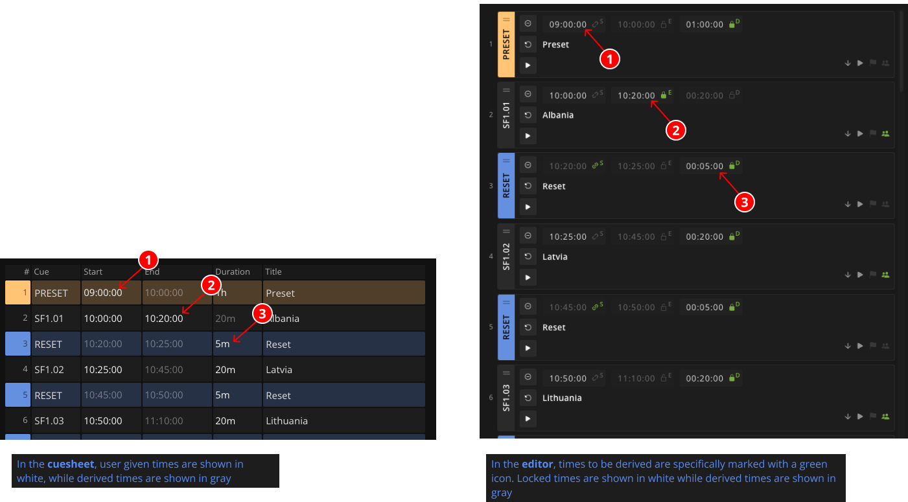

## Event times

Events in Ontime have three distinct time fields: `Start time`, `End time` and `Duration`.

The start of an event, can be linked to the [previous event end](#link-start).

In addition, it is reasonable that only two of these are necessary, ie: we can infer that `Duration = Start time + End time`.\
Ontime allows the user to define the [time strategy](#time-strategy) for calculating event schedules.

With these features combined, every time there is a change in your schedule, Ontime can propagate the changes to all future events.

### Link start
The start of an event can be linked to the end of the previous event.

You can achieve this by activating the Link start feature with the lock button next to the `Start time` field (*See note 1 in screenshot*). \
If this feature is enabled enabled, Ontime will keep the event start time in sync with the previous event End time.

Please note that this is a schedule feature. The start of the event is not automated.

:::note[Automate rundown progress]
You can automate the rundown playback progress by using the `End Action` options if the event: \
`None (default)` `Load Next` `Play Next`
:::

### Time strategy
Having established that we only need two time data points to describe an event schedule, Ontime provides a concept for **Time strategy**.

In short, this allows users to define which time field is significant for the schedule and should be locked / maintained. \
By default, Ontime defines the `Duration` to be the locked time, this default can be changed in `Editor` -> `Project settings` ->  `Rundown defaults`. 

In your rundown, you can define this per event, by activating the lock next to the input field (*See illustration note 2 for locking end, note 3 for locking duration*).

Considering the rundown from the above screenshot, what would happen if the End time of the first event (Albania) changed?
- If the event below (Latvia) has a **locked duration**, the End time will be pushed forward to maintain the event duration.
- If the event below were to have **locked End time** (as we do in Lithuania), the duration would be reduced to maintain the event end schedule. 

## Time entry shortcuts
Ontime allows shortcuts to speed and simplify the time entry. \
These shortcuts are available in all the time inputs.

| Entry                                   | Result                                                  | Note                                                                                                                                     |
| :-------------------------------------- | :------------------------------------------------------ | :--------------------------------------------------------------------------------------------------------------------------------------- |
| `1.20.3` `1 20 3` `1:20:03` `1,20,3`    | `01:20:03`                                              | `.` `,` `:` and `spaces` can be used as separators between `hh:mm:ss`                                                                    |
| `1.2.3` `1 2 3` `1:2:3` `1,2,3`         | `01:02:03`                                              | Three numeric fields are read as `hours:minutes:seconds`                                                                                 |
| `1.2` `1 2` `1:2`                       | `01:02:00`                                              | Two numeric fields are read as `hours:minutes`                                                                                           |
| `10`                                    | `00:10:00`                                              | A single numeric field (≤99) is read as `minutes`                                                                                        |
| `120`                                   | `01:20:00`                                              | A single numeric field (≥100) is separated into `hours` and `minutes`                                                                    |
| `1h30s`                                 | `01:00:30`                                              | `h` `m` and/or `s` can be used to indicate specific components                                                                           |
| `120m`                                  | `02:00:00`                                              | Named numeric fields can overflow                                                                                                        |
| `p`                                     | `09:00:00` (if previous event finishes at 09:00:00)     | The keyword `p` returns the end time of the previous event                                                                               |
| `+10m10s`                               | `09:10:10` (if previous event finishes at 09:00:00)     | Starting a time entry with a + sign, adds the time to the previous event                                                                 |
| `2.2.2` `2 2 2` `2:2:2` `2,2,2`         | `02:02:02`                                              | Leading zeros are not necessary                                                                                                          |
| `10:` or `:10`                          | `10:00:00` or `00:10:00`                                | Separators can be used to indicate where zero is omitted                                                                                 |
| `123456`                                | `12:34:56`                                              | Enter a full time-tag without separators (`hhmmss`; Note that you need six digits for this, otherwise it will be interpreted as minutes) |