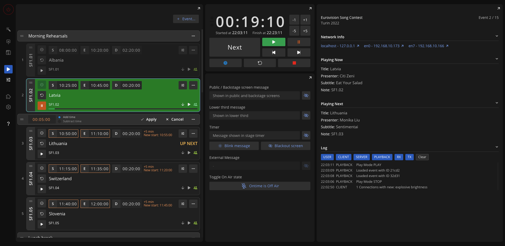

```bash title="Editor"
https://MY-IP-ADDRESS:4001/editor           
```

The `Editor` view shows a summary of the running timer along with the remaining schedule. \
This view will show any existing delays.


