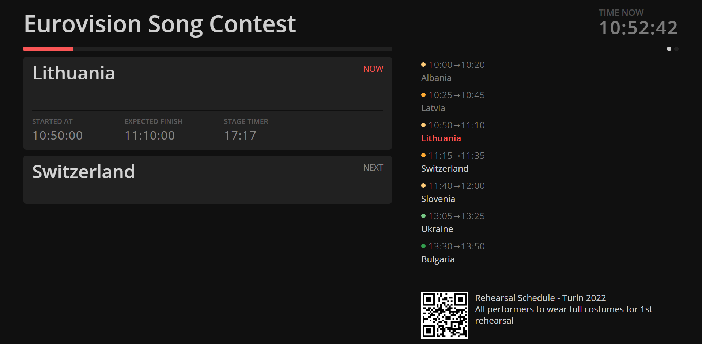

```bash title="Backstage / Stage Manager View"
https://MY-IP-ADDRESS:4001/backstage           
```

The `Backstage` view shows a summary of the running timer along with the remaining schedule. \
This view will show any existing delays .


