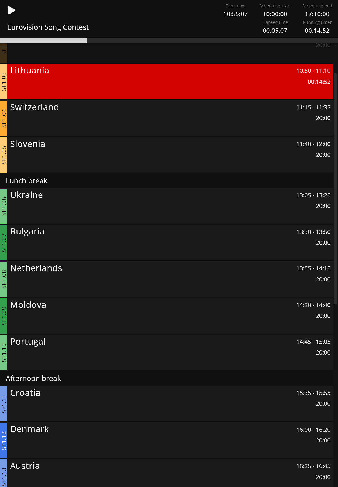

```bash title="Operator View"
https://MY-IP-ADDRESS:4001/operator           
```

The `Operator` is a completely automated view that follow the runtime playback. \
This view is designed for devices such as phones and tablets.


