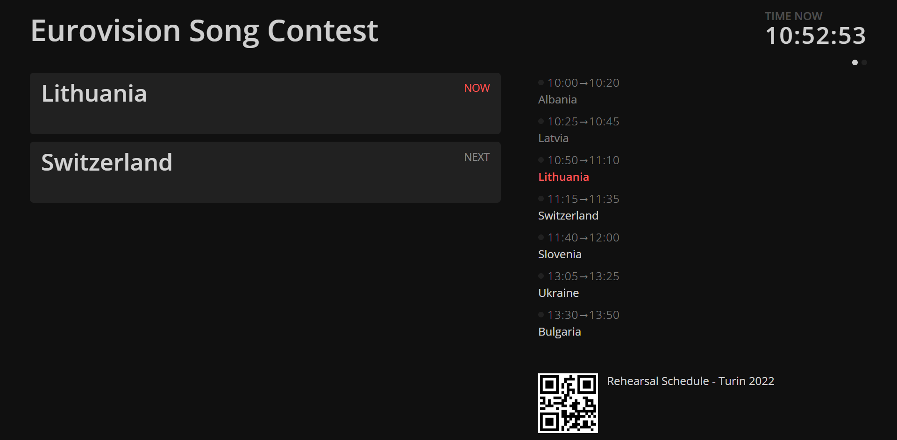

```bash title="Public / Foyer View"
https://MY-IP-ADDRESS:4001/public           
```

Similar to the `Backstage` view, the `Public` view shows the currently running and upcoming events, as well as a summary of the schedule.


